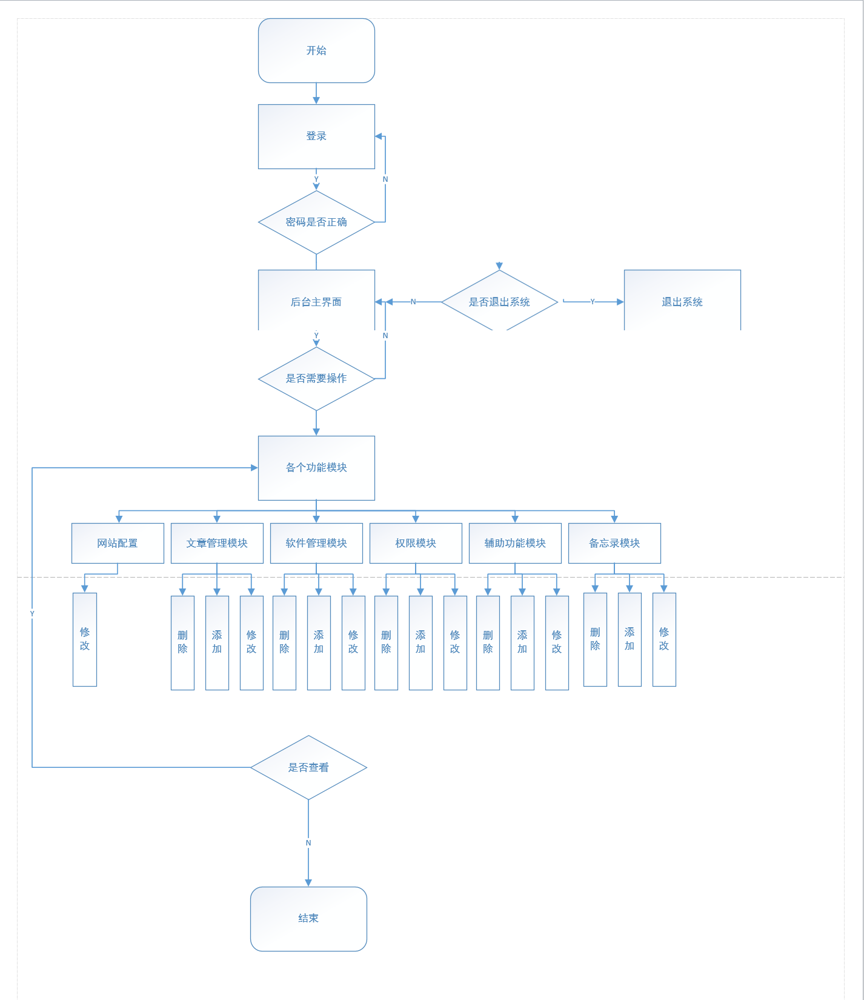

# 1. CMS(内容管理平台)
## 1.1. 模块
- 网站配置
- 文章管理模块
- 软件下载模块
- 辅助功能模块
- 权限模块
- 备忘录模块
## 1.2. 项目结构

## 1.3. 功能结构图

# 2. 使用到的技术
- 基础环境
win10+IDEA+JDK1.8+Tomcat8.5+MySql5.7
- 前端
JSP+layUI框架+Vue+JQuery+CSS
- 后台
SSM(Spring + Mybatis + Spring Mvc)+LayUI 框架+UEditor(百度)+JQuery EasyUI
# 3. 使用指南
- 先运行cms.sql到数据库文件(很重要)
- git clone下来项目,导入到idea,配置tomcat
-debug可以看到运行效果
# 4. 运行效果

- 首页

- 后台页面

# 5. 数据库的表设计

# 6. 注意事项
- 用户名和密码:ada和ada

